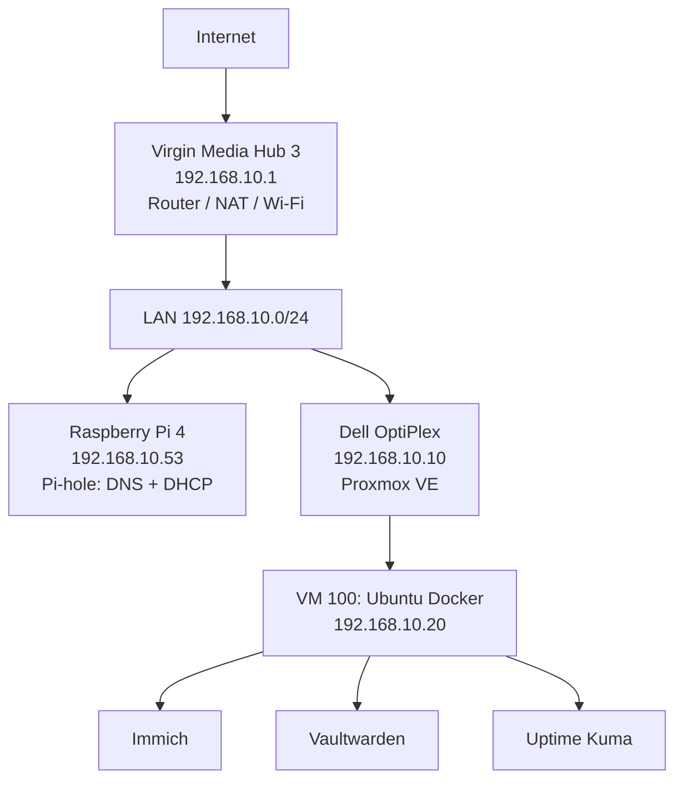

# Architecture (current implementation)

## Logical topology

```mermaid
flowchart TD
    Internet --> Hub["Virgin Media Hub 3<br/>192.168.10.1<br/>Router / NAT / Wi-Fi"]
    Hub --> LAN["LAN 192.168.10.0/24"]
    LAN --> Pi["Raspberry Pi 4<br/>192.168.10.53<br/>Pi-hole: DNS + DHCP"]
    LAN --> PVE["Dell OptiPlex<br/>192.168.10.10<br/>Proxmox VE"]
    PVE --> VM["VM 100: Ubuntu Docker<br/>192.168.10.20"]
    VM --> Immich
    VM --> Vaultwarden
    VM --> Kuma["Uptime Kuma"]
```

Addresses are sanitised and do not match the live network.
